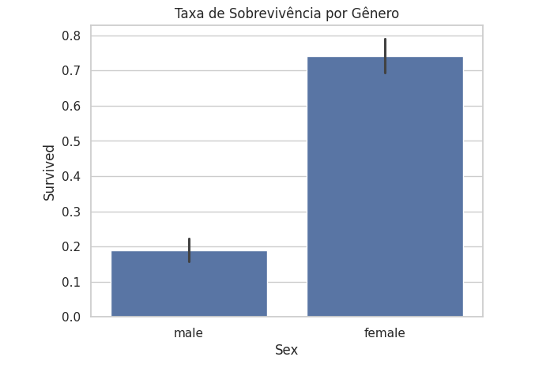
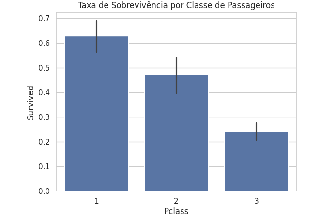

# Análise de Sobrevivência no Titanic

Este projeto tem como objetivo analisar os fatores que influenciaram a sobrevivência dos passageiros do Titanic, utilizando técnicas de análise exploratória de dados (EDA) e visualização. O conjunto de dados utilizado contém informações sobre os passageiros, como classe, gênero, idade, tarifa paga, porto de embarque e status de sobrevivência.

## Conjunto de Dados

O conjunto de dados utilizado é o **titanic-passengers.csv**, que contém as seguintes colunas:

- **PassengerId**: Identificador único do passageiro.
- **Survived**: Indica se o passageiro sobreviveu (1) ou não (0).
- **Pclass**: Classe do passageiro (1ª, 2ª ou 3ª classe).
- **Name**: Nome do passageiro.
- **Sex**: Gênero do passageiro (masculino ou feminino).
- **Age**: Idade do passageiro.
- **SibSp**: Número de irmãos/cônjuges a bordo.
- **Parch**: Número de pais/filhos a bordo.
- **Ticket**: Número do bilhete.
- **Fare**: Tarifa paga pelo passageiro.
- **Cabin**: Número da cabine (opcional).
- **Embarked**: Porto de embarque (C = Cherbourg, Q = Queenstown, S = Southampton).

## Objetivos do Projeto

1. **Análise Exploratória de Dados (EDA):**
   - Investigar as taxas de sobrevivência com base em variáveis como classe, gênero, idade, porto de embarque e tarifa.
   - Identificar padrões e correlações entre as variáveis.

2. **Visualização de Dados:**
   - Criar gráficos e visualizações para representar as descobertas da análise exploratória.

3. **Conclusão e Insights:**
   - Sintetizar as descobertas e contar uma história convincente sobre os fatores que influenciaram a sobrevivência no Titanic.

## Principais Insights

Após a análise dos dados, foram identificados os seguintes fatores que influenciaram significativamente a sobrevivência dos passageiros:

### 1. Classe Social (Pclass)
- Passageiros da **1ª classe** tiveram a maior taxa de sobrevivência (62,96%), seguidos pela **2ª classe** (47,28%) e pela **3ª classe** (24,24%).
- Isso sugere que a classe social foi um fator determinante, possivelmente devido ao acesso privilegiado aos botes salva-vidas.

### 2. Gênero (Sex)
- **Mulheres** tiveram uma taxa de sobrevivência muito maior (74,20%) em comparação com os **homens** (18,89%).
- Isso reflete a política de "mulheres e crianças primeiro" que foi adotada durante o resgate.

### 3. Idade (Age)
- **Crianças** tiveram a maior taxa de sobrevivência (59,65%), enquanto **idosos** tiveram a menor (22,22%).
- Isso reforça a prioridade dada a passageiros mais jovens durante o resgate.

### 4. Porto de Embarque (Embarked)
- Passageiros que embarcaram em **Cherbourg** tiveram a maior taxa de sobrevivência (55,36%), enquanto os que embarcaram em **Southampton** tiveram a menor (33,70%).
- Isso pode estar relacionado à distribuição de classes sociais entre os portos.

### 5. Família (SibSp e Parch)
- Passageiros que viajavam **sozinhos** tiveram uma taxa de sobrevivência menor (30,35%) em comparação com aqueles que viajavam com familiares (50,00%).
- Isso sugere que ter familiares a bordo pode ter ajudado na sobrevivência, possivelmente devido ao apoio mútuo.

### 6. Tarifa (Fare)
- Passageiros que pagaram tarifas mais altas tiveram maior probabilidade de sobreviver, o que está alinhado com a correlação entre tarifa e classe social.

## Visualizações

Aqui estão alguns exemplos de visualizações criadas durante a análise:

1. **Taxa de Sobrevivência por Gênero:**
   

2. **Taxa de Sobrevivência por Faixa Etária:**
   

